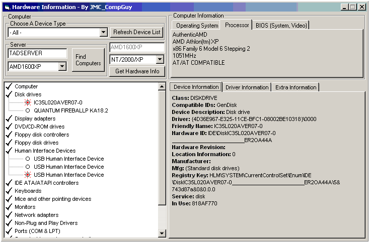



## Computer Infomation

### Description

Gathers hardware, software, bios, etc information from your computer, or any computer on your network. Automatically gets the names of all computers on your network. Retrieves hardware information including processor, BIOS, windows version, build, service pack level. Shows all hardware in your computer's records and marks those that the computer is currently using. Good example of using the registry, resource files, hex to decimal conversion, api calls, etc. Does not require anything to be installed on another computer.

Please vote, i've worked hard on this code, and let me know if you find any problems. Thanks!
 
### More Info
 
All you need to put in is either the server you are connected to, or your computer name.

Returns a lot of information about your compuer or any computer on your network.

             |
---                |---
**Submitted On**   |2002-02-05 21:56:12
**By**             |[JMC\_CompGuy](https://github.com/Planet-Source-Code/PSCIndex/blob/master/ByAuthor/jmc-compguy.md)
**Level**          |Advanced
**User Rating**    |4.6 (293 globes from 64 users)
**Compatibility**  |VB 6\.0
**Category**       |[Miscellaneous](https://github.com/Planet-Source-Code/PSCIndex/blob/master/ByCategory/miscellaneous__1-1.md)
**World**          |[Visual Basic](https://github.com/Planet-Source-Code/PSCIndex/blob/master/ByWorld/visual-basic.md)
**Archive File**   |[Computer\_I53337252002\.zip](https://github.com/Planet-Source-Code/jmc-compguy-computer-infomation__1-31520/archive/master.zip)

